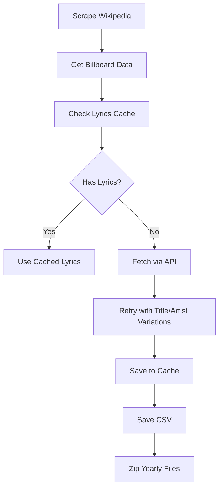

# Billboard Hot 100 Lyrics Analysis (1959-2024)

This project analyzes lyrical trends in Billboard Hot 100 songs from 1959 to 2024 through a comprehensive data pipeline covering collection, preprocessing, enrichment, and analysis.

## 🎯 Project Overview

I've developed an automated pipeline to:

1. Collect Billboard chart data from Wikipedia
2. Fetch song lyrics using async API requests
3. Clean and preprocess text data
4. Classify song genres using AI
5. Detect profanity in lyrics
6. Prepare data for sentiment and thematic analysis

The final dataset contains **6,500 songs** across 65 years of popular music.

## 🔑 Key Features

### 📊 Data Collection

#### 📜 Data Collection Workflow

- Scraped Billboard Year-End Hot 100 lists (1959-2024) from Wikipedia using BeautifulSoup
- Implemented intelligent async lyrics fetching from lyrics.ovh API
- Built caching system to avoid redundant API calls
- Created retry logic with artist/title variations
- The lyrics.ovh API, although a great opensource API to source lyrics, could not retrieve lyrics for all 6500 songs, which was either due to a mismatch in how the song Titles and Artist names were formatted in the Billboard list, or if the Title and Artist name matched but the lyrics were missing.
- There are about 1088 songs for which the lyrics could not be fetched, I tried looking for other APIs to source the lyrics but after being unable to do so, I created a function to manually input the songs which worked well but was extremely time consuming as I had to manually search every song on google or a lyrics site (eg. Genius) so I decided to proceed without filling in those lyrics. This will be something I address at a later time.
- Zipped yearly CSV files for efficient storage

### 🧹 Data Cleaning
- Consolidated 65 yearly CSV files into unified dataset
- Standardized artist names (handling "feat." variations)
- Processed lyrics with:
  - Structure marker removal ([Verse], [Chorus])
  - Contraction expansion (eg. "don't" → "do not")
  - Special character removal
  - Case normalization
  - Stopword removal
  - Lemmatization

### 🎸 Genre Classification
- I initially used the Spotify API to get the genre for all 6500 songs, but some of the issues I ran into:
      - Spotify only has the genre for Artists and not for individual songs
      - The genres are missing for a lot of the artists
      - Spotify can return multiple genres for an Artist, as one artist might have songs belonging to different genres
- To overcome issues with the Spotify API, I decided to use DeepSeek API for song-level genre prediction
- Although the DeepSeek API worked well to define the genres, but since the genre outputs included a lot of variations (e.g., synonyms, subgenres, inconsistent casing), I needed to consolidate these into a smaller, cleaner set of genres.
- I used ChatGPT to obtain raw genre labels, which I used to map the genres into a consolidated set of main genres.
- I created a function to Consolidate all raw genres into 12 main categories:
  - Pop, Rock, R&B, Hip-Hop, Country
  - Dance/Electronic, Jazz, Blues, Soul
  - Gospel/Christian, Classical, Reggae

### ⚠️ Profanity Detection
- Combined two profanity word lists:
  1. [zacanger/profane-words](https://github.com/zacanger/profane-words)
  2. [LDNOOBW List](https://github.com/LDNOOBW)
- Implemented fuzzy matching for obfuscated profanity:
  - "f@ck", "sh1t", "b!tch"
- Added annotations:
  - `profanity_words`: List of detected words
  - `profanity_count`: Numeric count
  - `contains_profanity`: Boolean flag

## 📂 Data Output

The final dataset (`billboard_hot100_cleaned.csv`) contains:

| Column | Description | Example |
|--------|-------------|---------|
| `Rank` | Billboard position | 1 |
| `Title` | Song title | "Blinding Lights" |
| `Artist` | Standardized artist name | "The Weeknd" |
| `Year` | Chart year | 2020 |
| `Lyrics` | Raw lyrics text | "I been tryna call..." |
| `Lyrics_Cleaned` | Processed lyrics | "tryna call..." |
| `genre` | DeepSeek-predicted genre | "synth-pop" |
| `consolidated_genre` | Standardized genre | "Pop" |
| `profanity_words` | List of profane terms | ["fuck"] |
| `profanity_count` | Profanity frequency | 4 |
| `contains_profanity` | Profanity flag | True |

## 📈 Next Steps for Analysis

The cleaned dataset is ready for:
1. **Sentiment Analysis**: Track emotional valence over decades
2. **Topic Modeling**: Identify recurring themes in lyrics
3. **Word Frequency**: Compare vocabulary across genres/eras
4. **Profanity Trends**: Analyze explicitness over time
5. **Genre Evolution**: Visualize genre popularity shifts
