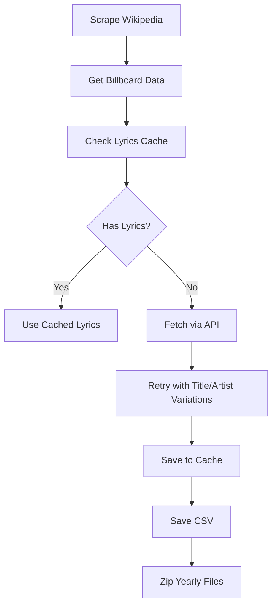

# Billboard Hot 100 Lyrics Analysis (1959-2024)


This project analyzes lyrical trends in [Billboard Hot 100](https://en.wikipedia.org/wiki/Billboard_Hot_100) songs from 1959 to 2024 through a comprehensive data pipeline covering collection, preprocessing, enrichment, and analysis.

## 🎯 Project Overview

I've developed an automated pipeline to:

1. Collect Billboard chart data from Wikipedia
2. Fetch song lyrics using async API requests
3. Clean and preprocess text data
4. Classify song genres using AI
5. Detect profanity in lyrics
6. Prepare data for sentiment and thematic analysis

The final dataset contains **6,500 songs** across 65 years of popular music.

## 🔑 Key Features

### 📊 Data Collection

#### 📜 Data Collection Workflow



- Scraped Billboard Year-End Hot 100 lists (1959-2024) from Wikipedia using BeautifulSoup
- Implemented intelligent async lyrics fetching from lyrics.ovh API
- Built caching system to avoid redundant API calls
- Created retry logic with artist/title variations
- The lyrics.ovh API, although a great opensource API to source lyrics, could not retrieve lyrics for all 6500 songs, which was either due to a mismatch in how the song Titles and Artist names were formatted in the Billboard list, or if the Title and Artist name matched but the lyrics were missing.
- There are about 1088 songs for which the lyrics could not be fetched, I tried looking for other APIs to source the lyrics but after being unable to do so, I created a function to manually input the songs which worked well but was extremely time consuming as I had to manually search every song on google or a lyrics site (eg. Genius) so I decided to proceed without filling in those lyrics. This will be something I address at a later time.
- Zipped yearly CSV files for efficient storage

#### 📦 Imports & Setup

This section imports all the essential libraries used throughout the notebook:

* **Web Scraping & Requests**: requests, BeautifulSoup – to scrape Billboard Hot 100 chart data from Wikipedia.

* **Async I/O & Networking**: aiohttp, asyncio, nest_asyncio – to enable asynchronous fetching of lyrics from an API for improved performance in a Jupyter environment.

* **Data Handling**: pandas, json, os – for efficient data manipulation, caching, and storage.

* **Utility**: tqdm.asyncio – for progress bars in asynchronous loops, and logging for monitoring execution.

* **nest_asyncio.apply**() is called to allow nested event loops for Google Colab, enabling smooth use of asyncio.run() inside the notebook.

``` bash
import requests
from bs4 import BeautifulSoup
import pandas as pd
import aiohttp
import asyncio
import urllib.parse
import time
import logging
from tqdm.asyncio import tqdm_asyncio
import nest_asyncio
import os
import json
import zipfile

# Applying nest_asyncio for notebook compatibility
nest_asyncio.apply()
logging.basicConfig(level=logging.INFO)
```

#### Creating function to scrape data from Billboard hot-100 year end pages on wikipedia

The function parses the HTML table on the wikipedia page using ***BeautifulSoup***, handles cases where artist names are omitted due to rowspans (if consecutive songs have the same artist), and returns a clean pandas DataFrame with the song's rank, title, and artist.

```bash
def scrape_hot_100(year):
    """Scrape Billboard Hot 100 for given year"""
    url = f"https://en.wikipedia.org/wiki/Billboard_Year-End_Hot_100_singles_of_{year}"
    try:
        response = requests.get(url, timeout=10)
        response.raise_for_status()
        soup = BeautifulSoup(response.content, 'html.parser')
    except Exception as e:
        logging.error(f"Error fetching {year}: {str(e)}")
        return None

    table = soup.find('table', {'class': 'wikitable sortable'})
    if table is None:
        logging.warning(f"Hot 100 table not found for {year}")
        return None

    data = []
    current_artist = None

    for row in table.find_all('tr')[1:]:  # Skip header
        cols = row.find_all('td')

        if len(cols) == 3:  # Full row with artist
            try:
                rank = int(cols[0].text.strip())
                title = cols[1].text.strip().strip('"')
                current_artist = cols[2].text.strip()
                data.append([rank, title, current_artist])
            except ValueError:
                continue

        elif len(cols) == 2 and current_artist:  # Rowspan artist case
            try:
                rank = int(cols[0].text.strip())
                title = cols[1].text.strip().strip('"')
                data.append([rank, title, current_artist])
            except ValueError:
                continue

    if not data:
        return None

    df = pd.DataFrame(data, columns=["Rank", "Title", "Artist"])
    return df.set_index("Rank")
```
#### 🎵 Lyric Fetching Functions

This section defines asynchronous functions to fetch song lyrics from the lyrics.ovh API ( [website](https://lyricsovh.docs.apiary.io/#) / [github](https://github.com/NTag/lyrics.ovh)). It includes:


*   **clean_artist_name()**: Cleans artist names by removing extra punctuation, featured artists, and brackets to improve match accuracy.

*   **fetch_lyrics()**: Sends asynchronous API requests to retrieve lyrics for a given artist and song title.

*   **fetch_with_retries()**: Tries multiple variations of artist and song title combinations to maximize the chance of a successful match, with optional retries and delays for robustness.

These functions work together to collect lyrics data while handling naming inconsistencies common in music metadata.

``` bash
def clean_artist_name(artist):
    """Optimized artist cleaning function"""
    if not isinstance(artist, str):
        return ""

    # Remove content in parentheses and brackets
    artist = re.sub(r'\([^)]*\)|\[[^\]]*\]', '', artist)

    # Handle common patterns with a single regex
    match = re.search(r'^([^,;&/]+?)(?:\s*(?:,|&|and|featuring?|ft\.?|with|/|x)\s|$)', artist, flags=re.IGNORECASE)
    return match.group(1).strip() if match else artist.strip()

async def fetch_lyrics(session, artist, title, timeout=8):
    """Fetch lyrics with optimized parameters"""
    artist_encoded = urllib.parse.quote(artist)
    title_encoded = urllib.parse.quote(title)
    url = f"https://api.lyrics.ovh/v1/{artist_encoded}/{title_encoded}"

    try:
        async with session.get(url, timeout=timeout) as response:
            if response.status == 200:
                data = await response.json()
                return data.get('lyrics', '')
            elif response.status == 404:
                return ''  # Known missing
    except (aiohttp.ClientError, asyncio.TimeoutError):
        return ''
    return ''

async def fetch_with_retries(session, artist, title, max_retries=3):

    # Clean artist name once
    primary_artist = clean_artist_name(artist)

    # Precompute title variations
    base_title = re.sub(r'\([^)]*\)', '', title).strip()
    base_title_no_punct = re.sub(r'[\!\?\.\,\']', '', base_title)
    base_title_no_feat = title.split(' (')[0].strip()

    # Prepare all variations upfront
    variations = [
        (primary_artist, title),
        (primary_artist, base_title),
        (primary_artist, base_title_no_feat),
        (artist.split(',')[0].strip(), title),
        (artist, title),
        (primary_artist, f"{base_title} (feat. ...)"),
        (primary_artist, base_title_no_punct),
    ]

    # Adding variations for problematic titles
    if any(char in title for char in ['!', '?', '.', ',', "'"]):
        variations.append((artist, base_title_no_punct))
        variations.append((primary_artist, base_title_no_punct))

    # Try variations without delay first
    for try_artist, try_title in variations[:max_retries]:
        lyrics = await fetch_lyrics(session, try_artist, try_title)
        if lyrics:
            return lyrics

    # Add delays only for remaining retries
    for i, (try_artist, try_title) in enumerate(variations[max_retries:max_retries*2]):
        await asyncio.sleep(0.2 * (i + 1))
        lyrics = await fetch_lyrics(session, try_artist, try_title)
        if lyrics:
            return lyrics

    return ''
```
####💾 Lyrics Caching System
This class implements a JSON-based cache to store and reuse fetched lyrics, reducing redundant API calls and improving efficiency. Key features include:

*   Persistent storage in lyrics_cache.json.

*   Efficient lookup using normalized artist and song title keys.

*   Periodic auto-saving every 50 entries to avoid frequent file I/O.

This helps speed up lyric retrieval in repeated or large-scale scraping runs.


``` bash
class LyricsCache:
    def __init__(self, cache_file='lyrics_cache.json'):
        self.cache_file = cache_file
        self.cache = self.load_cache()

    def load_cache(self):
        if os.path.exists(self.cache_file):
            try:
                with open(self.cache_file, 'r') as f:
                    return json.load(f)
            except:
                return {}
        return {}

    def save_cache(self):
        with open(self.cache_file, 'w') as f:
            json.dump(self.cache, f)

    def get_key(self, artist, title):
        return f"{clean_artist_name(artist)}|||{title.lower().strip()}"

    def get(self, artist, title):
        return self.cache.get(self.get_key(artist, title), None)

    def set(self, artist, title, lyrics):
        key = self.get_key(artist, title)
        self.cache[key] = lyrics
        # Save periodically rather than on every set
        if len(self.cache) % 50 == 0:
            self.save_cache()

    def __len__(self):
        return len(self.cache)

```
#### ⚙️ Main Execution Pipeline
This section orchestrates the full scraping and lyric-fetching workflow across multiple years of Billboard Hot 100 data. Key features include:

### process_year():

*   Scrapes chart data for a given year.

*   Retrieves cached lyrics where available.

*   Uses asynchronous batch requests to fetch missing lyrics concurrently.

*   Writes results to a CSV file and logs any failed fetches.

### main():

*   Coordinates the end-to-end process for multiple years.

*   Manages connection pooling via aiohttp for performance.

*   Persists the lyrics cache and logs missing entries for later review.


The workflow is designed for speed and efficiency, using async I/O, intelligent caching, and batch processing to handle large-scale data collection and enrichment.

``` bash
async def process_year(year, cache, session, concurrency=50):
    """Process a single year with caching and optimized fetching"""
    print(f"\n{'='*40}\nProcessing {year}\n{'='*40}")
    start_time = time.time()

    # Scrape Billboard data
    billboard_df = scrape_hot_100(year)
    if billboard_df is None:
        print(f"⚠️  No data found for {year}")
        return None, []

    print(f"Found {len(billboard_df)} songs for {year}")

    # Initialize lyrics column
    billboard_df['Lyrics'] = ''

    # Check cache first
    cached_count = 0
    for idx, row in billboard_df.iterrows():
        cache_key = cache.get_key(row['Artist'], row['Title'])
        if cache_key in cache.cache:
            billboard_df.at[idx, 'Lyrics'] = cache.cache[cache_key]
            cached_count += 1

    print(f"🚀 {cached_count}/{len(billboard_df)} lyrics from cache")

    # Prepare tasks for missing lyrics
    tasks = []
    for idx, row in billboard_df.iterrows():
        if not billboard_df.at[idx, 'Lyrics']:
            tasks.append(
                fetch_with_retries(session, row['Artist'], row['Title'])
            )

    # Process in batches for better memory management
    results = []
    batch_size = concurrency * 5  # Process in larger batches
    for i in range(0, len(tasks), batch_size):
        batch = tasks[i:i+batch_size]
        batch_results = await tqdm_asyncio.gather(
            *batch,
            desc=f"Fetching {year} lyrics",
            unit="song"
        )
        results.extend(batch_results)

    # Update DataFrame and cache
    result_idx = 0
    failed_entries = []
    for idx, row in billboard_df.iterrows():
        if not billboard_df.at[idx, 'Lyrics']:
            lyrics = results[result_idx]
            result_idx += 1

            if lyrics:
                billboard_df.at[idx, 'Lyrics'] = lyrics
                cache.set(row['Artist'], row['Title'], lyrics)
            else:
                failed_entries.append({
                    'Year': year,
                    'Artist': row['Artist'],
                    'Title': row['Title'],
                    'Rank': idx
                })

    # Save results
    billboard_df.to_csv(f"hot100_{year}.csv")
    elapsed = time.time() - start_time
    print(f"✅ Saved {year} data in {elapsed:.1f}s - {len(failed_entries)} missing")

    return billboard_df, failed_entries

async def main(years, concurrency=30):
    """Run the full scraping process with caching and concurrency"""
    cache = LyricsCache()
    all_data = {}
    all_failed_entries = []

    # Reusable HTTP session with connection pooling
    connector = aiohttp.TCPConnector(limit=concurrency)
    async with aiohttp.ClientSession(connector=connector) as session:
        for year in years:
            try:
                df, failed = await process_year(year, cache, session, concurrency)
                if df is not None:
                    all_data[year] = df
                    all_failed_entries.extend(failed)
            except Exception as e:
                print(f"🚨 Critical error processing {year}: {str(e)}")
                logging.exception(e)

    # Final cache save
    cache.save_cache()

    # Save failure log
    if all_failed_entries:
        fail_df = pd.DataFrame(all_failed_entries)
        fail_df.to_csv('missing_lyrics_log.csv', index=False)
        print(f"\nSaved {len(fail_df)} missing entries to log")

    return all_data

if __name__ == "__main__":
    # Years to process
    years_to_scrape = list(range(1959, 2025))

    # Run with high concurrency
    hot_100_data = asyncio.run(main(years_to_scrape, concurrency=40))

    # Show summary
    for year, df in hot_100_data.items():
        missing = df[df['Lyrics'] == '']
        print(f"{year}: {len(missing)} missing lyrics")

```

#### ❓ Identifying Missing Lyrics

Creates a subset DataFrame (df_missing_lyrics) with songs where lyrics are either:

NaN, or empty strings ("")

Outputs the shape to summarize how many lyrics are missing.

Useful for tracking what remains to be filled manually or via other means.

``` bash
df_missing_lyrics = all_years[all_years['Lyrics'].isna() | (all_years['Lyrics'].str.strip() == "")]

df_missing_lyrics.shape
```
(1088, 5)

#### Manually adding Lyrics

``` bash
try:
    for idx, row in df_missing_lyrics.iterrows():
        title = row['Title']
        artist = row['Artist']

        print(f"\n🔍 {title} {artist} lyrics")
        lyrics = input("📋 Paste the lyrics here:\n")

        all_years.at[idx, 'Lyrics'] = lyrics
        print(f"✅ Lyrics added for '{title}' by {artist} (index {idx})")

except KeyboardInterrupt:
    print("\n🚫 Stopped by user. Progress saved.")

```

#### 🗜️ Zipping Billboard Hot 100 CSV Files
The function **zip_csv_files()** automates the process of compressing individual Billboard Hot 100 CSV files into a single ZIP archive named hot100_data.zip. It checks for the existence of each yearly CSV file (e.g., hot100_2000.csv) and adds it to the archive if found.

The zipped file is useful for efficiently downloading and transferring the complete dataset between different stages of the project (e.g., from the Data Collection stage to pre-processing and analysis).


``` bash
def zip_csv_files(start_year=1959, end_year=2024, output_zip='hot100_data_all_years.zip'):
    with zipfile.ZipFile(output_zip, 'w') as zipf:
        for year in range(start_year, end_year + 1):
            filename = f"hot100_{year}.csv"
            if os.path.exists(filename):
                zipf.write(filename)
    print(f"✅ All CSV files zipped to {output_zip}")

# Create zip file
zip_csv_files()

```
### 🧹 Data Cleaning
- Consolidated 65 yearly CSV files into unified dataset
- Standardized artist names (handling "feat." variations)
- Processed lyrics with:
  - Structure marker removal ([Verse], [Chorus])
  - Contraction expansion (eg. "don't" → "do not")
  - Special character removal
  - Case normalization
  - Stopword removal
  - Lemmatization

#### 📂 Loading & Merging Yearly CSVs

Loops through all year-based .csv files (hot100_1959.csv to hot100_2024.csv) and appends them into one large DataFrame.

Uses error handling to skip missing files.

Result: all_years DataFrame containing all songs and lyrics from 1959 to 2024

``` bash
uploaded = files.upload()

with zipfile.ZipFile('hot100_data_all_years.zip', 'r') as zip_ref:
    zip_ref.extractall('.')

print("✅ Files extracted!")
```
``` bash
def load_all_data(years):

    """Load all yearly CSV files into a single DataFrame"""

    all_data = []

    for year in years:
        file_path = f"hot100_{year}.csv"
        if os.path.exists(file_path):
            df = pd.read_csv(file_path)
            df['Year'] = year
            all_data.append(df)

    if not all_data:
        raise ValueError("No data files found")

    return pd.concat(all_data, ignore_index=True)

all_years = load_all_data(list(range(1959, 2025)))
```
#### Clean Lyrics Text

Here we:

* Validate the dataset to make sure there aren't any duplicates and the ranking is in order (No ranks outside the expected range 0-100).

* Clean the lyrics by removing punctuation, converting text to lowercase, and eliminating irrelevant characters (e.g., line breaks, extra spaces etc.).

* Normalize the text for consistent tokenization and modeling.

```bash
#Check for duplicates
duplicates = all_years.duplicated(subset=['Title','Artist','Year'], keep=False).sum()
print(f"Found {duplicates} duplicate song entries")
```
Found 0 duplicate song entries

```bash
#Validate ranks (should be 1-100)
invalid_ranks = all_years[(all_years['Rank'] < 1) | (all_years['Rank'] > 100)]
print(f"Found {len(invalid_ranks)} entries with invalid ranks")
```
Found 0 entries with invalid ranks

```bash
# Artist name standardization
def clean_artist_name(name):
    """Standardize artist names with handling of 'feat.' and special cases"""

    if not isinstance(name, str):
        return name

    # Remove content in parentheses (common for disambiguation)
    name = re.sub(r'\([^)]*\)', '', name)

    # Standardization with word boundaries and space preservation
    name = re.sub(r'\b(ft|feat|featuring|with)\b[\.]*\s*', 'feat. ', name, flags=re.IGNORECASE)

    # Preserve essential special characters (apostrophes, hyphens, commas, periods)
    name = re.sub(r"[^a-zA-Z0-9\s',\.\-&]", '', name)

    # Trim whitespaces and convert to title case
    name = name.strip().title()

    # Ensure space after feat.

    name = re.sub(r'feat\.(\S)', r'feat. \1', name)  # Add space if missing
    name = re.sub(r'\s+', ' ', name)  # Remove extra spaces
    name = re.sub(r'\bAnd\b', 'and', name)  # Lowercase conjunctions

    return name

# Apply cleaning
all_years['Artist'] = all_years['Artist'].apply(clean_artist_name)

# Verify fixes
print("Fixed artist name examples:")
fixed_samples = [
    ('Rihanna featuring Jay-Z', 'Rihanna Feat. Jay-Z'),
    ('Lil\' Kim featuring Da Brat, Left Eye, Missy Elliott and Angie Martinez',
     'Lil\' Kim Feat. Da Brat, Left Eye, Missy Elliott and Angie Martinez'),
    ('Ja Rule featuring Ashanti', 'Ja Rule Feat. Ashanti')
]

for original, expected in fixed_samples:
    cleaned = clean_artist_name(original)
    print(f"Original: '{original}'")
    print(f"Cleaned:  '{cleaned}'")
    print(f"Status:   {'✅' if cleaned == expected else '❌'} Expected '{expected}'")
    print()
```
Fixed artist name examples:
Original: 'Rihanna featuring Jay-Z'
Cleaned:  'Rihanna Feat. Jay-Z'
Status:   ✅ Expected 'Rihanna Feat. Jay-Z'

Original: 'Lil' Kim featuring Da Brat, Left Eye, Missy Elliott and Angie Martinez'
Cleaned:  'Lil' Kim Feat. Da Brat, Left Eye, Missy Elliott and Angie Martinez'
Status:   ✅ Expected 'Lil' Kim Feat. Da Brat, Left Eye, Missy Elliott and Angie Martinez'

Original: 'Ja Rule featuring Ashanti'
Cleaned:  'Ja Rule Feat. Ashanti'
Status:   ✅ Expected 'Ja Rule Feat. Ashanti'

#### Remove Stopwords and Tokenize

* Commonly used words (e.g., 'the', 'and') that don't contribute much semantic meaning are removed. This helps improve the performance of downstream models like topic modeling and sentiment analysis.

* Lyrics are split into individual tokens to prepare the data for vectorization and allow the model to analyze frequency and context of each word.

```bash
def timeout_handler(signum, frame):
    raise TimeoutError("Lyrics processing timed out")

# Initialize NLP tools
stop_words = set(stopwords.words('english'))
lemmatizer = WordNetLemmatizer()

def clean_lyrics(lyrics, remove_stopwords=True):
    """
    Core lyrics cleaning function with complete implementation
    """
    if pd.isna(lyrics) or not isinstance(lyrics, str) or lyrics.strip() == "":
        return ""

    try:
        # Remove song structure markers
        lyrics = re.sub(r'\[.*?\]', ' ', lyrics)  # Remove [Verse], [Chorus], etc.
        lyrics = re.sub(r'\(.*?\)', ' ', lyrics)   # Remove (spoken), (backing vocals)

        # Handle newlines and special whitespace
        lyrics = re.sub(r'\r\n|\n|\r', ' ', lyrics)  # Convert newlines to spaces
        lyrics = re.sub(r'\s+', ' ', lyrics)         # Collapse multiple spaces

        # Standardize contractions
        contractions = {
            "i'm": "i am", "you're": "you are", "he's": "he is", "she's": "she is",
            "it's": "it is", "we're": "we are", "they're": "they are", "that's": "that is",
            "ain't": "am not", "aren't": "are not", "can't": "cannot", "could've": "could have",
            "didn't": "did not", "doesn't": "does not", "don't": "do not", "hadn't": "had not",
            "hasn't": "has not", "haven't": "have not", "he'd": "he would", "he'll": "he will",
            "i'd": "i would", "i'll": "i will", "i've": "i have", "isn't": "is not",
            "let's": "let us", "might've": "might have", "must've": "must have", "needn't": "need not",
            "she'd": "she would", "she'll": "she will", "should've": "should have", "that'd": "that would",
            "there's": "there is", "they'd": "they would", "they'll": "they will", "they've": "they have",
            "wasn't": "was not", "we'd": "we would", "we'll": "we will", "we've": "we have",
            "weren't": "were not", "what'll": "what will", "what're": "what are", "what's": "what is",
            "where's": "where is", "who's": "who is", "won't": "will not", "would've": "would have",
            "you'd": "you would", "you'll": "you will", "you've": "you have"
        }
        for cont, expanded in contractions.items():
            lyrics = re.sub(r'\b' + cont + r'\b', expanded, lyrics, flags=re.IGNORECASE)

        # Remove non-essential characters
        lyrics = re.sub(r"[^a-zA-Z0-9' ]", " ", lyrics)  # Keep alphanumeric + apostrophes
        lyrics = re.sub(r"\s+", " ", lyrics).strip()     # Clean whitespace

        # Case normalization
        lyrics = lyrics.lower()

        # Tokenization and NLP processing
        tokens = nltk.word_tokenize(lyrics)

        if remove_stopwords:
            tokens = [word for word in tokens if word not in stop_words]

        # Lemmatization with POS consideration (verb focus)
        pos_tags = nltk.pos_tag(tokens)
        lemmatized_tokens = []
        for word, tag in pos_tags:
            if tag.startswith('V'):  # Verbs
                lemma = lemmatizer.lemmatize(word, pos='v')
            else:  # Default to noun
                lemma = lemmatizer.lemmatize(word)
            lemmatized_tokens.append(lemma)

        return " ".join(lemmatized_tokens)

    except Exception as e:
        logging.error(f"Error cleaning lyrics: {str(e)}")
        return ""

def clean_lyrics_with_timeout(lyrics, timeout=30):
    """Wrapper with timeout for clean_lyrics"""
    try:
        signal.signal(signal.SIGALRM, timeout_handler)
        signal.alarm(timeout)
        result = clean_lyrics(lyrics)
        signal.alarm(0)
        return result
    except TimeoutError:
        print(f"⚠️ Timeout processing lyrics (truncated): {lyrics[:50]}...")
        return ""
    except Exception as e:
        print(f"⚠️ Error processing lyrics: {str(e)}")
        return ""

# Apply with progress tracking and interrupt handling
try:
    print("Starting lyrics cleaning (press Ctrl+C to cancel)...")

    # Initialize column if not exists
    if 'Lyrics_Cleaned' not in all_years.columns:
        all_years['Lyrics_Cleaned'] = None

    # Process in chunks for better control
    chunk_size = 500
    total_chunks = len(all_years) // chunk_size + 1

    for i in range(total_chunks):
        start_idx = i * chunk_size
        end_idx = min((i + 1) * chunk_size, len(all_years))
        print(f"Processing chunk {i+1}/{total_chunks} (rows {start_idx}-{end_idx})...")

        # Process current chunk with timeout protection
        all_years.loc[start_idx:end_idx, 'Lyrics_Cleaned'] = (
            all_years.loc[start_idx:end_idx, 'Lyrics']
            .apply(clean_lyrics_with_timeout)
        )

    print("✅ Lyrics cleaning completed!")

except KeyboardInterrupt:
    print("\n🚫 Processing interrupted by user! Partial results saved.")
    # Calculate how many were processed
    processed = all_years['Lyrics_Cleaned'].notna().sum()
    print(f"Processed {processed}/{len(all_years)} records")

except Exception as e:
    print(f"\n❌ Fatal error: {str(e)}")
    raise
finally:
    # Ensure any partial results are preserved
    print("Saving current progress...")
    all_years.to_csv('billboard_hot100_partial.csv', index=False)
    print("Partial results saved to 'billboard_hot100_partial.csv'")
```
Starting lyrics cleaning (press Ctrl+C to cancel)...
Processing chunk 1/14 (rows 0-500)...
Processing chunk 2/14 (rows 500-1000)...
Processing chunk 3/14 (rows 1000-1500)...
Processing chunk 4/14 (rows 1500-2000)...
Processing chunk 5/14 (rows 2000-2500)...
Processing chunk 6/14 (rows 2500-3000)...
Processing chunk 7/14 (rows 3000-3500)...
Processing chunk 8/14 (rows 3500-4000)...
Processing chunk 9/14 (rows 4000-4500)...
Processing chunk 10/14 (rows 4500-5000)...
Processing chunk 11/14 (rows 5000-5500)...
Processing chunk 12/14 (rows 5500-6000)...
Processing chunk 13/14 (rows 6000-6500)...
Processing chunk 14/14 (rows 6500-6500)...
✅ Lyrics cleaning completed!
Saving current progress...
Partial results saved to 'billboard_hot100_partial.csv'


### 🎸 Genre Classification
In the initial stage, I attempted to retrieve genre information using the Spotify API. However, the Spotify API only provides genres at the artist level, not the song level. This introduced two key limitations:

* Incomplete Coverage: Many songs had missing genre data because the artist's genre wasn't always available via the API.

* Granularity Issues: Artists are often associated with multiple genres, making it challenging to pinpoint a single genre for individual songs. Furthermore, these genres are based on the artist's overall work rather than the specific song, reducing accuracy.

Given these shortcomings, I decided to use deepseek api for more precise and complete genre classification. This approach provided:

* Song-specific genre tagging, which is more accurate than relying on artist-level metadata.

* Higher coverage, especially for older songs or niche tracks not well-covered by Spotify’s API.

This allowed me to classify genres more contextually and accurately, resolving the issues encountered with the Spotify API.


```bash
nest_asyncio.apply()

# Configure these constants
API_KEY = "API-KEY"
API_URL = "https://api.deepseek.com/v1/chat/completions"
CONCURRENCY_LIMIT = 30  # Higher since no strict rate limit
REQUEST_TIMEOUT = 300  # 5 minutes for slow responses
MAX_ATTEMPTS = 5

@retry(
    stop=stop_after_attempt(MAX_ATTEMPTS),
    wait=wait_exponential(multiplier=1, min=2, max=30),
    retry=retry_if_exception(lambda e: isinstance(e, (aiohttp.ClientError, asyncio.TimeoutError))))


async def fetch_genre(session, artist, title, identifier):

    prompt = (
        f"Predict the most likely music genre for '{title}' by {artist}. "
        "Output ONLY the genre name with no additional text."
    )

    headers = {"Authorization": f"Bearer {API_KEY}"}

    payload = {
        "model": "deepseek-chat",
        "messages": [{"role": "user", "content": prompt}],
        "max_tokens": 8,
        "temperature": 0.1,
        "stop": ["\n"]
    }

    try:
        async with session.post(
            API_URL,
            json=payload,
            headers=headers,
            timeout=aiohttp.ClientTimeout(total=REQUEST_TIMEOUT)
        ) as resp:
            # Handle potential long delays
            start_time = time.time()
            while True:
                if resp.content:
                    try:
                        data = await resp.json()
                        return (identifier, data['choices'][0]['message']['content'].strip())
                    except (aiohttp.ContentTypeError, json.JSONDecodeError):
                        # Handle keep-alive comments
                        raw = await resp.text()
                        if 'choices' in raw:
                            json_start = raw.find('{')
                            if json_start != -1:
                                try:
                                    data = json.loads(raw[json_start:])
                                    return (identifier, data['choices'][0]['message']['content'].strip())
                                except json.JSONDecodeError:
                                    pass

                # Timeout check
                if time.time() - start_time > REQUEST_TIMEOUT:
                    raise asyncio.TimeoutError("Response timeout")

                # Wait before checking again
                await asyncio.sleep(0.5)

    except (aiohttp.ClientError, asyncio.TimeoutError) as e:
        error_type = "[TIMEOUT]" if "timed out" in str(e) else "[ERROR]"
        return (identifier, error_type)
    except Exception as e:
        return (identifier, f"[EXCEPTION] {str(e)}")

async def process_song(session, semaphore, row, identifier):
    async with semaphore:
        return await fetch_genre(session, row['Artist'], row['Title'], identifier)

async def get_genres_for_df(df):
    semaphore = asyncio.Semaphore(CONCURRENCY_LIMIT)
    tasks = []
    results = []

    # Create unique identifier for each row (artist + title + index)
    df['_identifier'] = df.apply(
        lambda row: f"{row['Artist']}|{row['Title']}|{row.name}",
        axis=1
    )

    # Create tasks
    async with aiohttp.ClientSession() as session:
        for idx, row in df.iterrows():
            task = asyncio.create_task(
                process_song(session, semaphore, row, row['_identifier'])
            )
            tasks.append(task)

        # Setup progress bar
        with tqdm(total=len(tasks), desc="Processing songs") as pbar:
            for future in asyncio.as_completed(tasks):
                try:
                    result = await future
                    results.append(result)
                except Exception as e:
                    # Shouldn't happen due to retry, but safe guard
                    identifier = "UNKNOWN_ID"
                    if hasattr(future, '_identifier'):
                        identifier = future._identifier
                    results.append((identifier, f"[UNHANDLED] {str(e)}"))
                finally:
                    pbar.update(1)
                    pbar.set_postfix_str(f"Processed: {pbar.n}/{pbar.total}")

    # Create mapping from identifier to genre
    genre_map = {identifier: genre for identifier, genre in results}

    # Apply results to DataFrame using identifiers
    df['genre'] = df['_identifier'].map(genre_map)
    df.drop(columns=['_identifier'], inplace=True)

    return df

def run_genre_fetch(df):
    total_songs = len(df)

    # Detailed cost estimation
    est_cost = total_songs * 0.000035  # Based on $0.035/1000 songs
    approval = input(
        f"About to process {total_songs} songs\n"
        f"Estimated cost: ${est_cost:.5f}\n"
        f"Concurrency: {CONCURRENCY_LIMIT} requests\n"
        "Proceed? (yes/no): "
    ).strip().lower()

    if approval != 'yes':
        print("Operation cancelled")
        return df

    print("Starting processing... Press Ctrl+C to cancel and save partial results")
    try:
        start_time = time.time()
        df = asyncio.run(get_genres_for_df(df))
        elapsed = time.time() - start_time
        print(f"\nCompleted in {elapsed/60:.1f} minutes")
    except KeyboardInterrupt:
        print("\nProcess interrupted by user - saving partial results")
        return df

    # Analysis
    success_count = df['genre'].apply(
        lambda x: x not in ["", "[ERROR]", "[TIMEOUT]", "[EXCEPTION]", "[UNHANDLED]"] and not x.startswith("[")
    ).sum()
    error_count = total_songs - success_count

    print(f"\nResults: {success_count} succeeded | {error_count} failed")
    if error_count > 0:
        error_types = df[df['genre'].str.startswith('[')]['genre'].value_counts()
        print("Error breakdown:")
        print(error_types.to_string())

    return df

```
```bash
all_years_genre = run_genre_fetch(all_years)
```
```bash
# Filter the rows where genre is '[ERROR]'
error_df = all_years_genre[all_years_genre['genre'] == '[ERROR]'].copy()

# Re-run genre classification on those rows
fixed_genres_df = run_genre_fetch(error_df)

all_years_genre.loc[fixed_genres_df.index, 'genre'] = fixed_genres_df['genre']
```
About to process 0 songs
Estimated cost: $0.00000
Concurrency: 30 requests
Proceed? (yes/no): yes
Starting processing... Press Ctrl+C to cancel and save partial results
Processing songs: 0it [00:00, ?it/s]
Completed in 0.0 minutes

Results: 0.0 succeeded | 0.0 failed

#### Generating and Consolidating Genre Data
After obtaining raw genre predictions from DeepSeek, I exported all of the genres into a CSV file (genres.csv). Since the genre outputs from both methods included variations (e.g., synonyms, subgenres, inconsistent casing), I needed to consolidate these into a smaller, cleaner set of genres.

To do this:

* I used ChatGPT to obtain raw genre labels, which I used to map the genres into a consolidated set of main genres.

* This helped normalize entries like "hip hop", "Hip-Hop", and "rap" under a unified label such as "Hip-Hop".

This cleaned and consolidated genre dataset provides a solid foundation for analysis, such as visualizing genre trends over time or analyzing the relationship between lyrical themes and genre.

``` bash
genres= pd.DataFrame(all_years_genre['genre'])
genres.to_csv('genres.csv')
```
The genres.csv file was used to map sub-genres/alternatives to main genres:

``` bash
def consolidate_genre(genre):
    genre = str(genre).lower().strip()

    if any(x in genre for x in ['r&b', 'rnb', 'rhythm and blues']):
        return 'R&B'
    elif 'pop' in genre:
        return 'Pop'
    elif 'rock' in genre:
        return 'Rock'
    elif 'hip hop' in genre or 'rap' in genre or 'hip-hop'in genre or 'trap' in genre:
        return 'Hip-Hop'
    elif 'folk' in genre:
        return 'Folk'
    elif 'country' in genre:
        return 'Country'
    elif 'dance' in genre or 'edm' in genre or 'dubstep' in genre or 'house' in genre or 'electronic' in genre or 'afrobeat' in genre or 'afro-beat' in genre or 'techno' in genre:
        return 'Dance/Electronic'
    elif 'metal' in genre:
        return 'Metal'
    elif 'jazz' in genre:
        return 'Jazz'
    elif 'blues' in genre and 'rhythm' not in genre:
        return 'Blues'
    elif 'soul' in genre:
        return 'Soul'
    elif 'gospel' in genre or 'christian' in genre:
        return 'Gospel/Christian'
    elif 'classical' in genre:
        return 'Classical'
    elif 'reggae' in genre or 'reggaeton' in genre:
        return 'Reggae'
    elif genre in ['[error]', 'unknown', '', 'none']:
        return 'Unknown'
    else:
        return genre.title()
```

After initial consolidation, there were still too many genres (imo!) so I used the same method to get another mapping list from ChatGPT:

``` bash
# Further Consolidating genres
genre_mapping = {
    # Rock
    "Rock": "Rock", "Grunge": "Rock", "Metal": "Rock", "New Wave": "Rock", 
    "Post-Hardcore": "Rock", "Glam Rock": "Rock", "Punk": "Rock", "Merseybeat": "Rock",
    
    # Pop
    "Pop": "Pop", "Synthpop": "Pop", "Adult Contemporary": "Pop", "Easy Listening": "Pop",
    "Schlager": "Pop", "Bubblegum Pop": "Pop",
    
    # R&B/Soul
    "R&B": "R&B/Soul", "Soul": "R&B/Soul", "Motown": "R&B/Soul", "Funk": "R&B/Soul",
    "Doo-Wop": "R&B/Soul", "New Jack Swing": "R&B/Soul", "Quiet Storm": "R&B/Soul",
    
    # Hip-Hop
    "Hip-Hop": "Hip-Hop/Rap", "Rap": "Hip-Hop/Rap", "Crunk": "Hip-Hop/Rap", 
    "Trap": "Hip-Hop/Rap", "Drill": "Hip-Hop/Rap", "G-Funk": "Hip-Hop/Rap",
    
    # Country/Folk
    "Country": "Country/Folk", "Folk": "Country/Folk", "Bluegrass": "Country/Folk", 
    "Americana": "Country/Folk", "Honky Tonk": "Country/Folk",
    
    # Jazz/Blues
    "Jazz": "Jazz/Blues", "Blues": "Jazz/Blues", "Big Band": "Jazz/Blues", 
    "Swing": "Jazz/Blues", "Dixieland": "Jazz/Blues", "Bossa Nova": "Jazz/Blues",
    
    # Electronic
    "Electronic": "Electronic/Dance", "Disco": "Electronic/Dance", "House": "Electronic/Dance",
    "Techno": "Electronic/Dance", "Trance": "Electronic/Dance", "Synthwave": "Electronic/Dance",
    "Freestyle": "Electronic/Dance", "Dubstep": "Electronic/Dance", "Dance/Electronic": "Electronic/Dance",
    "Dance": "Electronic/Dance", "Dubstep": "Electronic/Dance",
    
    # Reggae
    "Reggae": "Reggae/Ska", "Ska": "Reggae/Ska", "Dancehall": "Reggae/Ska",
    
    # Latin
    "Salsa": "Latin", "Mambo": "Latin", "Bachata": "Latin", "Soca": "Latin",
    
    # Classical/Soundtrack
    "Classical": "Classical/Soundtrack", "Film Score": "Classical/Soundtrack", 
    "Video Game Music": "Classical/Soundtrack", "Musical Theatre": "Classical/Soundtrack",
    "James Bond Theme": "Classical/Soundtrack",
    
    # Other
    "Gospel/Christian": "Gospel/Christian",
    "Children'S Music": "Children's",
    "Christmas Music": "Holiday",
    "World Music": "World",
    "Exotica": "World",
    "Novelty": "Other",
    "Comedy": "Other",
}

# Map genres to broader categories
all_years_genre["consolidated_genre"] = all_years_genre["consolidated_genre"].map(genre_mapping).fillna("Other")

```

### ⚠️ Profanity Detection
To enhance the analysis and enable filtering or profiling of lyrical content, I implemented a profanity detection mechanism using two comprehensive open-source lists:

The [zacanger/profane-words JSON list](https://github.com/zacanger/profane-words).

The [LDNOOBW plaintext list](https://github.com/LDNOOBW/List-of-Dirty-Naughty-Obscene-and-Otherwise-Bad-Words).

These lists were combined and normalized into a single set of profane words.

To account for obfuscated or stylized profanity (e.g., "f@ck", "sh1t", "b!tch"), I created a substitution map to fuzzify the spelling of common profane terms. Each word was transformed into a regex pattern capable of matching various leetspeak variants.

The following annotations were added to the dataset:

* profanity_words: a list of all detected profane words in each song's cleaned lyrics.

* profanity_count: a numeric count of profane words per song.

* contains_profanity: a Boolean indicating whether the song contains any profanity.

This will help support both:

* Exploratory analysis (e.g., trends in explicit content over decades).

* Downstream modeling as an additional input feature, such as filtering before topic modeling or correlating with genre or sentiment.

``` bash
# Fetch the JSON profane-words list
def fetch_profane_words_json():
    url = "https://raw.githubusercontent.com/zacanger/profane-words/master/words.json"
    try:
        response = requests.get(url)
        response.raise_for_status()
        return response.json()
    except Exception as e:
        print("Error fetching profane-words list:", e)
        return []

# Fetch the plaintext LDNOOBW list
def fetch_ldnoobw_list():
    url = "https://raw.githubusercontent.com/LDNOOBW/List-of-Dirty-Naughty-Obscene-and-Otherwise-Bad-Words/master/en"
    try:
        response = requests.get(url)
        response.raise_for_status()
        return response.text.strip().splitlines()
    except Exception as e:
        print("Error fetching LDNOOBW list:", e)
        return []

# Combine both lists into a set
profane_words = fetch_profane_words_json()
ldnoobw_words = fetch_ldnoobw_list()
combined_profanity = set(word.lower() for word in profane_words + ldnoobw_words)
```
``` bash
# Substitution mapping
substitution_map = {
    'a': ['a', '@', '4'],
    'b': ['b', '8'],
    'c': ['c', '(', '{', '[', '<'],
    'e': ['e', '3'],
    'g': ['g', '9'],
    'i': ['i', '1', '!', '|'],
    'l': ['l', '1', '|', '!', '£'],
    'o': ['o', '0'],
    's': ['s', '$', '5'],
    't': ['t', '7', '+'],
    'z': ['z', '2']
}

def fuzzify_word(word):
    pattern = ''
    for char in word.lower():
        if char in substitution_map:
            subs = ''.join(re.escape(c) for c in substitution_map[char])
            pattern += f'[{subs}]'
        else:
            pattern += re.escape(char)
    return pattern

def compile_fuzzy_profanity_pattern(word_list):
    fuzzy_patterns = [fuzzify_word(word) for word in word_list]
    return re.compile(r'\b(?:' + '|'.join(fuzzy_patterns) + r')\b', flags=re.IGNORECASE)

profanity_pattern = compile_fuzzy_profanity_pattern(combined_profanity)

def count_profanity(text):
    if not isinstance(text, str) or not text.strip():
        return None
    return len(profanity_pattern.findall(text))

def extract_profanities(text):
    if not isinstance(text, str) or not text.strip():
        return None
    return profanity_pattern.findall(text)

all_years_genre['profanity_words'] = all_years_genre['Lyrics_Cleaned'].apply(extract_profanities)

all_years_genre['profanity_count'] = all_years_genre['profanity_words'].apply(lambda x: len(x) if isinstance(x, list) else None)

all_years_genre['contains_profanity'] = all_years_genre['profanity_count'].apply(lambda x: x is not None and x > 0)
```
``` bash
all_years_genre.to_csv('billboard_hot100_cleaned.csv', index=False)
```
``` bash
# Save the cleaned dataset to the repository directory
all_years_genre.to_csv('/content/billboard-lyrics-trend-analysis/billboard_hot100_cleaned.csv', index=False)
```

## 📂 Data Output

The final dataset (billboard_hot100_cleaned.csv) contains:

| Column | Description | Example |
|--------|-------------|---------|
| Rank | Billboard position | 1 |
| Title | Song title | "Blinding Lights" |
| Artist | Standardized artist name | "The Weeknd" |
| Year | Chart year | 2020 |
| Lyrics | Raw lyrics text | "I been tryna call..." |
| Lyrics_Cleaned | Processed lyrics | "tryna call..." |
| genre | DeepSeek-predicted genre | "synth-pop" |
| consolidated_genre | Standardized genre | "Pop" |
| profanity_words | List of profane terms | ["fuck"] |
| profanity_count | Profanity frequency | 4 |
| contains_profanity | Profanity flag | True |

## 📈 Next Steps for Analysis

The cleaned dataset is ready for:
- **Topic Modeling**: Identify recurring themes in lyrics
- **Word Frequency**: Compare vocabulary across genres/eras
- **Profanity Trends**: Analyze explicitness over time
- **Genre Evolution**: Visualize genre popularity shifts
